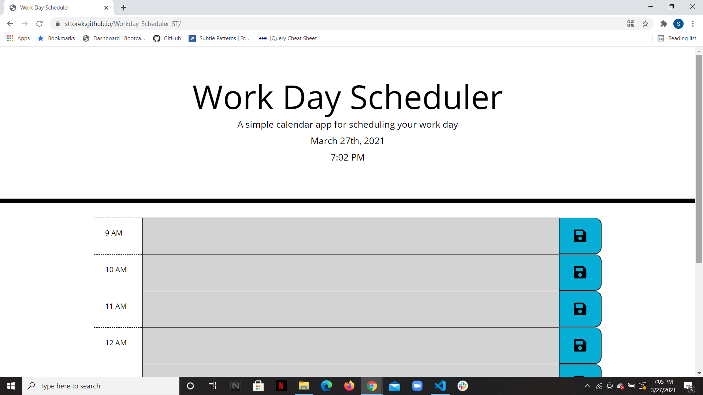

# Workday-Scheduler

For this app I've created a daily workday schedule. I used local storage so that users data is saved to their machine making this webpage completely reusable. The rows are also color coded based on the time of the day. 

Site- https://sttorek.github.io/Workday-Scheduler-ST/

